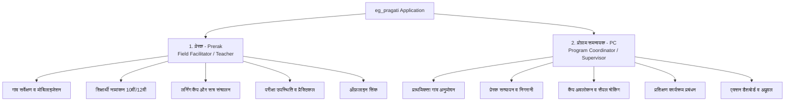
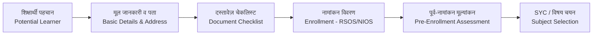
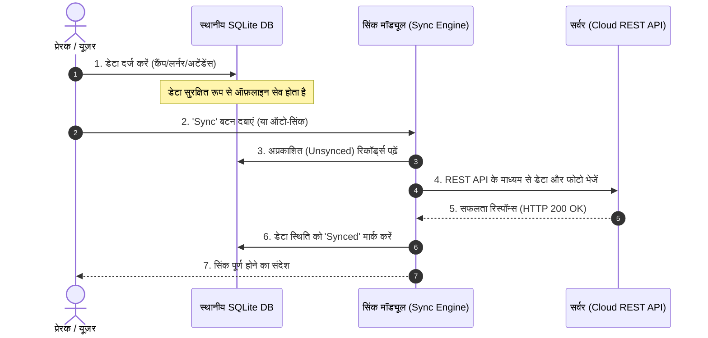

# 📱 Educate Girls - Pragati App Complete Documentation (प्रोजेक्ट दस्तावेज़)

---

## 📌 1. प्रोजेक्ट का परिचय (Project Overview)

**`eg_pragati`** (Educate Girls Pragati) एक **Flutter-आधारित मोबाइल एप्लीकेशन** है, जिसे **Educate Girls NGO** के लिए विकसित किया गया है। 

### 🎯 मुख्य उद्देश्य (Primary Objective):
इस ऐप का मुख्य उद्देश्य ग्रामीण और दूरदराज के क्षेत्रों की **अशिक्षित / ड्रॉपआउट लड़कियों (Learners)** को चिह्नित करना, उनका नामांकन (Enrollment) 10वीं (नीव - Neev) और 12वीं (प्रयास/उन्नति - Prayas/Unnati) की दूरस्थ शिक्षा परीक्षाओं (NIOS / RSOS ओपन बोर्ड) में कराना, उनके लिए लर्निंग कैंप (Learning Camps) आयोजित करना और उनकी पूरी शैक्षणिक यात्रा की निगरानी करना है।

### 🌐 ऑफ़लाइन-फर्स्ट डिज़ाइन (Offline-First Architecture):
चूंकि प्रेरक और फील्ड वर्कर इंटरनेट नेटवर्क से दूर ग्रामीण क्षेत्रों में कार्य करते हैं, इसलिए यह ऐप **पूर्ण रूप से ऑफ़लाइन (Offline-First)** काम करता है। सारा डेटा लोकल **SQLite डेटाबेस** में सेव होता है और इंटरनेट मिलते ही सर्वर (Cloud REST API) पर **सिंक (Sync)** हो जाता है।

---

## 🏗️ 2. तकनीकी संरचना (Tech Stack & Architecture)

| घटक (Component) | प्रयुक्त तकनीक (Technology Used) | विवरण |
| :--- | :--- | :--- |
| **Framework** | Flutter (Dart) | क्रॉस-प्लेटफॉर्म मोबाइल ऐप डेवलपमेंट |
| **State Management** | BLoC Pattern (`flutter_bloc`, `equatable`) | क्लीन आर्किटेक्चर और प्रेडिक्टेबल स्टेट मैनेजमेंट |
| **Database (Offline)** | SQLite (`sqflite`), Shared Preferences | स्थानीय डेटाबेस, सत्र भंडारण और ऑफ़लाइन सिंकिंग |
| **Networking** | REST APIs (`http`), Custom Exception Handlers | सर्वर कम्यूनिकेशन |
| **Navigation** | `go_router` | डिक्लेरेटिव राउटिंग सिस्टम |
| **Hardware Access** | Camera, Geolocator, Biometric (`local_auth`) | फोटो कैप्चर, जिओ-लोकेशन टैगिंग और बायोमेट्रिक लॉगिन |
| **Flavors / Environments** | DEV, QA, UAT, PROD, Training | अलग-अलग सर्वर वातावरणों के लिए फ्लेवर कॉन्फ़िगरेशन |

---

## 👥 3. यूज़र रोल्स (User Roles & Responsibilities)

इस एप्लीकेशन में मुख्य रूप से **2 मुख्य यूज़र रोल्स (User Roles)** हैं:

---

### 1️⃣ प्रेरक (Prerak - Field Worker / Teacher)
प्रेरक गांव के स्तर पर कार्य करने वाली मुख्य फील्ड कार्यकर्ता होती हैं।
* **मुख्य जिम्मेदारियां:**
  * अपने गांव में अशिक्षित/ड्रॉपआउट बालिकाओं (Learners) की पहचान करना।
  * बालिकाओं का पंजीकरण, दस्तावेजीकरण और 10वीं/12वीं बोर्ड में नामांकन कराना।
  * 10वीं (नीव) और 12वीं (प्रयास/उन्नति) के लर्निंग कैंप आयोजित करना।
  * प्रतिदिन सत्र (Sessions) लेना, उपस्थिति दर्ज करना और बेसलाइन/मिडलाइन/एंडलाइन मूल्यांकन करना।
  * परीक्षा केंद्र, हॉल टिकट और प्रैक्टिकल अंकों का प्रबंधन करना।
  * ऑफ़लाइन दर्ज किए गए डेटा को इंटरनेट मिलने पर सर्वर पर सिंक करना।

---

### 2️⃣ प्रोग्राम समन्वयक (Program Coordinator - PC / Supervisor)
प्रोग्राम समन्वयक कई गांवों और प्रेरकों की देखरेख करने वाले सुपरवाइजर/मैनेजर होते हैं।
* **मुख्य जिम्मेदारियां:**
  * **Priority Village Approval:** प्रेरकों द्वारा चिह्नित गांवों को स्वीकृत/अस्वीकृत करना।
  * **Prerak Verification:** प्रेरकों की प्रोफ़ाइल, केवाईसी और दस्तावेजों का सत्यापन करना।
  * **Camp Observation / Sample Execution:** कैंपों का औचक निरीक्षण और सैंपल सत्र लेना।
  * **Activity & Mobilization Monitoring:** प्रगति सभा, कम्युनिटी बैठकों और सरकारी अधिकारियों के साथ बैठकों का पर्यवेक्षण।
  * **Action Dashboard:** लंबित कार्यों और रिपोर्टों की त्वरित समीक्षा एवं स्वीकृति देना।
  * **Training Management:** प्रेरकों के लिए ट्रेनिंग इवेंट आयोजित करना और अटेंडेंस दर्ज करना।

---

## 🔄 4. ऐप का पूरा फ्लो (End-to-End Application Flow)

### 🔑 चरण 1: प्रमाणीकरण एवं ऑनबोर्डिंग (Authentication & Onboarding)
1. **भाषा चयन (Language Selection):** यूजर अपनी सुविधानुसार भाषा (हिंदी/अंग्रेजी आदि) चुनता है।
2. **लॉगिन (Login):**
   * मोबाइल नंबर और OTP सत्यापन।
   * यूज़र आईडी / पासवर्ड तथा सुरक्षा PIN बनाना।
   * बायोमेट्रिक (फिंगरप्रिंट/फेस) लॉगिन समर्थन।
3. **सिस्टम सुरक्षा जांच:** डिवाइस आईडी, एंड्रॉइड वर्जन, रैम, फ्री स्टोरेज और लोकेशन परमिशन की जांच।

---

### 📝 चरण 2: प्रेरक प्रोफ़ाइल व केवाईसी (Prerak Profile & KYC)
* प्रेरक को अपनी पूरी जानकारी दर्ज करनी होती है:
  * **व्यक्तिगत विवरण:** नाम, फोटो, संपर्क, पता, सामाजिक श्रेणी (Social Category)।
  * **योग्यता व अनुभव:** शैक्षणिक योग्यता, पिछला नौकरी/स्वयंसेवक अनुभव।
  * **केवाईसी दस्तावेज़:** आधार कार्ड, पैन कार्ड, बैंक विवरण, पुलिस सत्यापन (Police Verification) और फ्रीलांसर समझौता (Freelancer Agreement)।
* PC द्वारा इस प्रोफ़ाइल की जांच और स्वीकृति दी जाती है।

---

### 📣 चरण 3: मोबिलाइजेशन और कम्युनिटी मैपिंग (Mobilization & Community Engagement)
1. **प्राथमिकता गांव (Priority Village Survey):** प्रेरक अपने क्षेत्र के गांवों का सर्वेक्षण करती हैं।
2. **यूनिवर्स लर्नर पहचान (Universe Learner Identification):** गांव की संभावित बालिकाओं (Potential Learners) की सूची तैयार करना।
3. **कम्युनिटी मैपिंग (Community Mapping):** गांव के प्रभावशाली व्यक्तियों, अभिभावकों और पंचायत सदस्यों को जोड़ना।
4. **प्रगति सभा (Pragati Sabha):** जागरूकता अभियानों और सामुदायिक बैठकों का आयोजन और फोटो/लोकेशन रिकॉर्ड करना।

---

### 🎓 चरण 4: शिक्षार्थी नामांकन (Learner Management - 10th & 12th)

* **10वीं (Neev Track):** 10वीं कक्षा की बालिकाओं का पंजीकरण, आधार/फोटो अपडेट, बोर्ड चयन (RSOS/NIOS), विषय चयन और पूर्व-नामांकन मूल्यांकन।
* **12वीं (Prayas / Unnati Track):** 12वीं की बालिकाओं का अलग ट्रैक जिसमें 12वीं के विषयों, प्रैक्टिकल और विशेष कोचिंग कैंप की प्रविष्टि होती है।
* **विशेष आवश्यकताएं:** विकलांगता विवरण (Disability), पारिवारिक सहमति पत्र (Family Consent Form) और संदर्भ (References)।

---

### 🏕️ चरण 5: लर्निंग कैंप और सत्र संचालन (Camp Management & Execution)

कैंप ऐप का सबसे महत्वपूर्ण मॉड्यूल है:

1. **कैंप निर्माण (Camp Registration):**
   * कैंप का प्रकार (10th Neev, 12th Prayas, Unnati Boot Camp)।
   * कैंप स्थान (Camp Location), सुविधाएं (Facilities), किट सामग्री (Kit Material Detail) और वेन्यू फोटो।
   * शिक्षार्थियों की मैपिंग (Learner Assignment)।
2. **कैंप सत्र निष्पादन (Daily Session Execution):**
   * **दैनिक उपस्थिति (Daily Attendance):** शिक्षार्थियों की दैनिक उपस्थिति लगाना।
   * **मूल्यांकन (Assessments):** Base Line, Mid Line, End Line टेस्ट अंक दर्ज करना।
   * **अनियमित शिक्षार्थी (Irregular Learners):** अनुपस्थित रहने वाली बालिकाओं को चिह्नित करना और कारण दर्ज करना।
   * **बैकलॉग सत्र (Backlog Execution):** किसी कारणवश छूटे हुए पुराने सत्रों की पूर्ति करना।

---

### 📋 चरण 6: परीक्षा प्रबंधन (Examination & Pre-Exam Module)
* **Pre-Exam Phase:**
  * बोर्ड परीक्षा अनुसूची (Exam Schedule) की प्रविष्टि।
  * हॉल टिकट सत्यापन और फोटो अपलोड।
* **Exam Execution Phase:**
  * परीक्षा के दिन शिक्षार्थी की उपस्थिति।
  * थ्योरी एवं प्रैक्टिकल (Practical Marks) अंकों की प्रविष्टि।
  * परीक्षा केंद्र किट विवरण।

---

### 🤝 चरण 7: प्रगति साथी मंच (PSM Formation & Meetings)
* प्रगति साथी मंच (PSM) सामुदायिक समूहों का गठन करता है।
* बैठकें आयोजित करना, सार्थी मंच बैठकों का विवरण दर्ज करना और PRI सहमति प्राप्त करना।

---

### ☁️ चरण 8: डेटा सिंक प्रक्रिया (Data Synchronization Flow)

ऑफ़लाइन डेटा को सर्वर पर भेजने और सर्वर से नया डेटा प्राप्त करने का क्रम:

---

### 📊 चरण 9: पीसी निगरानी व एक्शन डैशबोर्ड (PC Monitoring & Action Dashboard Flow)
1. **PC Home:** जिले/ब्लॉक/गांव के अनुसार आंकड़े प्रदर्शित होते हैं।
2. **Action Dashboard:** 
   * अनुमोदनाधीन गांव (Pending Village Approvals)।
   * प्रेरकों की सत्यापन स्थिति।
   * बैकलॉग एवं छूटे हुए कैंप सत्रों की सूची।
3. **Sample Camp Execution & Observation:** PC स्वयं कैंप में जाकर कुछ छात्रों का सैंपल असेसमेंट लेता है और ऐप में रिकॉर्ड दर्ज करता है ताकि डेटा की गुणवत्ता बनी रहे।
4. **PC Training & Attendance:** पीसी द्वारा प्रेरकों की ट्रेनिंग बैठकों की उपस्थिति लेना।

---

## 🛠️ 5. तकनीकी विशेषताएं व हाइलाइट्स (Key Technical Highlights)

1. **मल्टी-फ्लेवर बिल्ड सिस्टम (Multi-Flavor Support):**
   * DEV (`pragatidev.educategirls.ngo`)
   * QA (`staging.educategirls.ngo`)
   * UAT (`pragatiuat.educategirls.ngo`)
   * PROD
2. **सुरक्षा व गोपनीयता (Security Features):**
   * SHA-256 सॉल्टेड पासवर्ड एन्क्रिप्शन (`Micro@<username>1003`)
   * पिन कोड तथा बायोमेट्रिक सुरक्षा लॉक।
3. **जिओ-टैगिंग और फोटो साक्ष्य (Geo-Tagging & Photo Evidence):**
   * प्रत्येक महत्वपूर्ण गतिविधि (लॉगिन, कैंप सत्र, बैठक, परीक्षा) के साथ अक्षांश/देशांतर (Lat/Long) और लाइव फोटो ली जाती है।
4. **स्थान और अनुमति प्रबंधन (Location & Permission Handlers):**
   * लोकेशन परमिशन न होने पर लॉगिन/लॉगआउट प्रतिबंधित करने का कड़ा सुरक्षा नियम।

---

## 📝 6. संक्षिप्त निष्कर्ष (Summary for Senior Management)

> **`eg_pragati`** ऐप एजुकेट गर्ल्स एनजीओ के फील्ड ऑपरेशन्स की रीढ़ की हड्डी है। यह ऐप **प्रेरक (शिक्षिका)** को बालिकाओं को खोजने से लेकर उनके 10वीं/12वीं की परीक्षा उत्तीर्ण कराने तक की पूरी यात्रा को डिजिटल रूप से ट्रैक करने की सुविधा देता है, जबकि **प्रोग्राम समन्वयक (PC)** को गुणवत्ता नियंत्रण, निगरानी और अनुमोदन की शक्ति प्रदान करता है। पूर्णतः ऑफ़लाइन काम करने की क्षमता इसे भारत के सबसे सुदूर ग्रामीण क्षेत्रों के लिए अत्यंत प्रभावी बनाती है।

---
